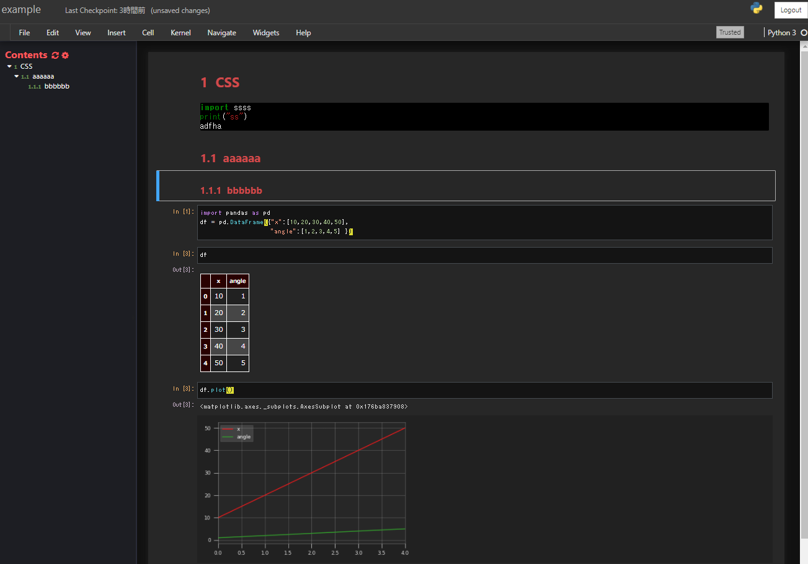

# jupyter_style_myao

This is jupyter notebook style repo.

1. install
   - custom.css
     copy to ".jupyter/custom/custom.css"
   - matplotlibrc
     copy to ".matplotlib/matplotlibrc"
1. style_image

    